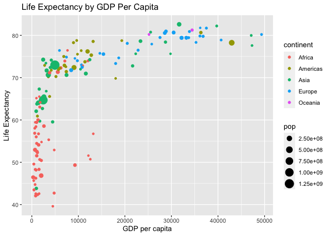

GGPlot Throwback
================

## Back to PS02

*Context: One of our first problem sets had us recreate a plot from
ModernDive, a scatterplot that included details for continent, GDP per
capita, and life expectancy. This uses the gapminder package.*

### Summary

The following shows some of the summary statistics for the variables
included in the scatterplot.

``` r
gapminder_2007 <- gapminder %>% 
  filter(year == 2007)
summary(gapminder_2007)
```

    ##         country       continent       year         lifeExp     
    ##  Afghanistan:  1   Africa  :52   Min.   :2007   Min.   :39.61  
    ##  Albania    :  1   Americas:25   1st Qu.:2007   1st Qu.:57.16  
    ##  Algeria    :  1   Asia    :33   Median :2007   Median :71.94  
    ##  Angola     :  1   Europe  :30   Mean   :2007   Mean   :67.01  
    ##  Argentina  :  1   Oceania : 2   3rd Qu.:2007   3rd Qu.:76.41  
    ##  Australia  :  1                 Max.   :2007   Max.   :82.60  
    ##  (Other)    :136                                               
    ##       pop              gdpPercap      
    ##  Min.   :1.996e+05   Min.   :  277.6  
    ##  1st Qu.:4.508e+06   1st Qu.: 1624.8  
    ##  Median :1.052e+07   Median : 6124.4  
    ##  Mean   :4.402e+07   Mean   :11680.1  
    ##  3rd Qu.:3.121e+07   3rd Qu.:18008.8  
    ##  Max.   :1.319e+09   Max.   :49357.2  
    ## 

### The Scatterplot

This was the plot created for PS02, **with some labels added**:

<!-- -->

### Analysis:

It appears as if many of the countries with both a relatively low GDP
per capita and life expectancy are in Africa, while many of those with
the highest life expectancies and GDP are from Europe, Oceania, Asia,
and the Americas. This makes sense as many countries in Africa have been
*deeply* harmed by colonization by mainly European countries who have
profited off of this exploitation and violence.

Interestingly, there appears to be a sharp increase in life expectancy
while GDP increases up to around **10,000**. It continues to increase
somewhat with GDP, and there is clearly a positive relationship present,
but it does level out somewhat once GDP meets this threshold. This
implies that GDP does matter in increasing a country’s life expectancy,
but once GDP meets a certain point, there are **diminishing returns** in
its effects on life expectancy. It would be interesting to look at how
*quality of life* continues to improve, as this is immensely important
but not necessarily directly related to life expectancy (and also far
more difficult to quantify). I would expect to see continually
increasing quality of life as GDP increases.
